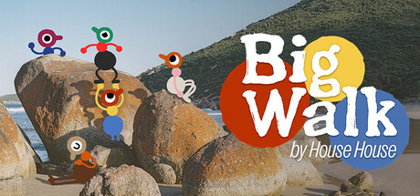
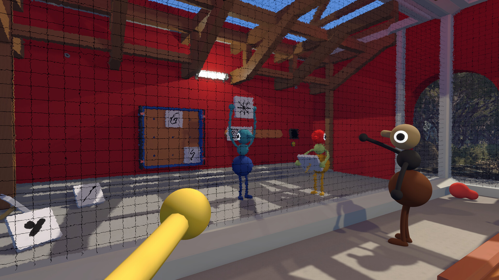

# Big Walk — Exploration Practice Tools

**Find your bearings, revisit a challenge and keep the discovery yours.**

`PC focus` · `Module concept - not implemented` · `Private co-op practice research`

> **Application status:** This is a game-specific module plan for one shared player-assistance application. No implemented or verified module is included in this package.

## The game and the idea

Big Walk is a cooperative exploration and puzzle game built around communication. Its assistance theme is navigation and challenge practice, with no invented combat economy or character levelling system.

**Game release status:** Released on 4 Aug, 2026. Checked against the [Steam listing](https://store.steampowered.com/app/1478500/) on 2026-09-05.

## Proposed assistance options

These are development targets. Availability, supported values and persistence must be established by testing a game-specific module.

| Area | Planned behaviour |
|---|---|
| **Route bookmarks** | Plan player-created landmarks and routes that can be used as an external reference during exploration. |
| **Layered clues** | Design optional hints in stages, beginning with a nudge and only revealing a fuller solution when requested. |
| **Challenge practice** | Investigate versioned practice snapshots for replaying a completed challenge with the group. |
| **Movement experiments** | Research movement-related practice settings only where a private-session prototype can preserve puzzle and world consistency. |
| **Progress reference** | Provide a manually maintained checklist for visited areas and discovered challenges. |
| **Group profiles** | Record agreed practice settings so the whole group knows how an experimental session differs from an ordinary one. |

## A practical use case

A group is stuck at a landmark. The planned assistant first shows the group's own route notes, then offers a small clue, keeping the full solution hidden until requested.

## Project and download page

### [Open the shared application page →](https://flyn.im/Xa-3hO)

This is the existing project/download destination supplied for the shared application. Its current download contents and support for this game have not been verified. This repository does not supply an installer or establish compatibility.

## Game gallery

 

*Official game imagery, not screenshots of the proposed application. Source links are listed in [image credits](assets/CREDITS.md).*

## What matters for this game

Google Trends exposed a specific landmark query and "big walk hidden achievements". These support an exploration angle. The official audio patches mean this package should not be positioned as a missing-volume-slider fix.

## Questions

<strong>Is this module available to use now?</strong>

No verified module is included here. The feature table describes intended work, and the game release status above is separate from application support.

<strong>Does the application change the game automatically?</strong>

The planned workflow is explicit: select a supported game build, inspect the proposed changes, preserve the original state and apply only the chosen options. The exact workflow still requires implementation.

<strong>Will every game update be supported?</strong>

Support must be checked per build. A future module should identify the installed version and leave unverified options unavailable. Compatibility evidence belongs in [COMPATIBILITY.md](COMPATIBILITY.md).

## Further reading

- [Feature scope and acceptance criteria](FEATURES.md)
- [Compatibility and current support](COMPATIBILITY.md)
- [Official sources and image provenance](SOURCES.md)

---

Independent project. Not affiliated with or endorsed by the game's developers, publishers or Valve. Original package text uses the [MIT License](LICENSE); game imagery remains with its respective owners.
                                                                                                    